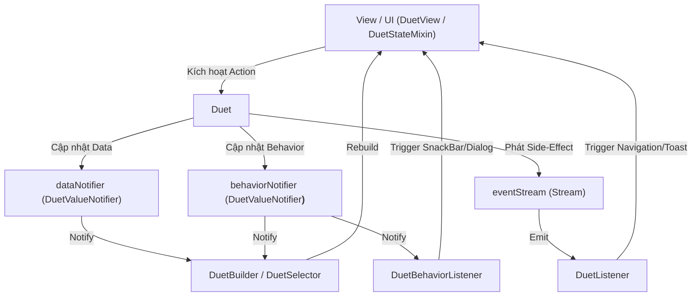
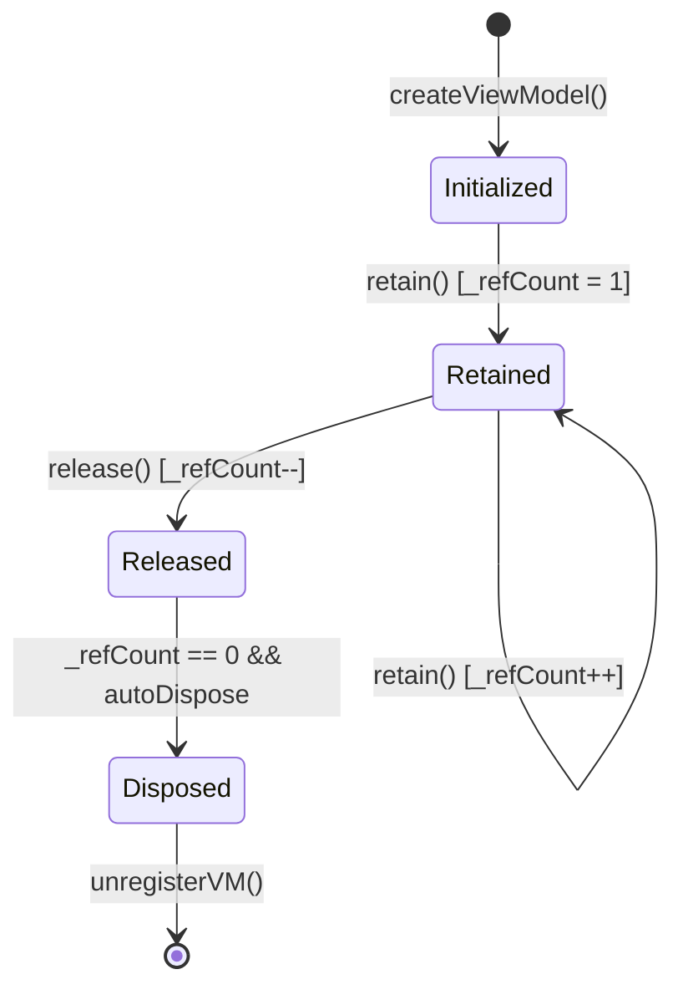

# 📖 BÁO CÁO KỸ THUẬT CHI TIẾT: THIẾT KẾ VÀ HOÀN THIỆN THƯ VIỆN `DUET`

> **Dự án**: `duet` - Giải pháp Quản lý Trạng thái & Kiến trúc Dual-Notifier MVVM Thuần Flutter (Zero Dependencies).  
> **Vị trí tài liệu**: `doc/vi/duet_technical_doc.md`
> **Phiên bản**: 3.0 (Chuyển đổi toàn diện sang kiến trúc Duet Native APIs).

> **Ghi chú hiện hành:** Exact lookup `DuetScope.of<VM>` dùng index
> `InheritedElement` của Flutter. API legacy tra theo `<D, B>` giữ fallback
> duyệt ancestor để tương thích; vì vậy không nên mô tả mọi lookup là O(1).
> Code mới nên ưu tiên `DuetWatch<VM>`.

---

## 📋 MỤC LỤC

1. [Tổng Quan Kiến Trúc & Triết Lý Thiết Kế](#1-tổng-quan-kiến-trúc--triết-lý-thiết-kế)
2. [Từng Bước Xây Dựng & Triển Khai Mã Nguồn](#2-từng-bước-xây-dựng--triển-khai-mã-nguồn)
   - [Bước 1: Chuẩn hóa Trạng thái UI với Sealed Classes (`UiState`)](#bước-1-chuẩn-hóa-trạng-thái-ui-với-sealed-classes-uistate)
   - [Bước 2: Nền tảng ViewModel Kép (`Duet` & `DuetValueNotifier`)](#bước-2-nền-tảng-viewmodel-kép-duet--duetvaluenotifier)
   - [Bước 3: Hệ thống Scope & Dependency Injection (`_AnyDuetScope`, `DuetScope` & `DuetRegistry`)](#bước-3-hệ-thống-scope-truy-vấn-o1--dependency-injection-_anyduetscope-duetscope--duetregistry)
   - [Bước 4: Quản lý Vòng đời Scoped ViewModel Độc lập (`DuetStateMixin` & `DuetView`)](#bước-4-quản-lý-vòng-đời-scoped-viewmodel-độc-lập-duetstatemixin--duetview)
   - [Bước 5: Xử lý Side-Effect Events & Notification 1 lần (`DuetListener` & `DuetBehaviorListener`)](#bước-5-xử-lý-side-effect-events--notification-1-lần-duetlistener--duetbehaviorlistener)
   - [Bước 6: Tối ưu Hiệu năng & Khắc phục Reactive Glitch (`batch()` & `emitState()`)](#bước-6-tối-ưu-hiệu-năng--khắc-phục-reactive-glitch-batch--emitstate)
   - [Bước 7: Bộ UI Widgets Phản ứng Tự động Đồng bộ (`DuetBuilder` & `DuetSelector`)](#bước-7-bộ-ui-widgets-phản-ứng-tự-động-đồng-bộ-duetbuilder--duetselector)
3. [Phân Tích Thuật Toán & Cơ Chế Hoạt Động Cốt Lõi](#3-phân-tích-thuật-toán--cơ-chế-hoạt-động-cốt-lõi)
   - [3.1 Thuật toán Đếm tham chiếu (Reference Counting) & AutoDispose](#31-thuật-toán-đếm-tham-chiếu-reference-counting--autodispose)
   - [3.2 Cơ chế Truy vấn Scope](#32-cơ-chế-truy-vấn-scope)
   - [3.3 Tối ưu hóa tầng Flutter Engine (Synchronous Rebuild & Transactional Batching)](#33-tối-ưu-hóa-tầng-flutter-engine-synchronous-rebuild--transactional-batching)
4. [Bảng So Sánh Kiến Trúc Chi Tiết](#4-bảng-so-sánh-kiến-trúc-chi-tiết)
5. [Hướng Dẫn Sử Dụng & Pattern Mã Nguồn Mẫu](#5-hướng-dẫn-sử-dụng--pattern-mã-nguồn-mẫu)
6. [Ghi Log Debug Toàn Cục & VS Code Snippets](#6-ghi-log-debug-toàn-cục--vs-code-snippets-dx-enhancements)

---

## 1. TỔNG QUAN KIẾN TRÚC & TRIẾT LÝ THIẾT KẾ

Thư viện `duet` ra đời nhằm giải quyết một thách thức lớn trong lập trình Flutter: **Xây dựng một hệ thống Quản lý Trạng thái (State Management) và Kiến trúc MVVM mạnh mẽ, chuẩn hóa nhưng KHÔNG PHỤ THUỘC vào bất kỳ thư viện bên thứ ba nào (Zero External Dependencies)**.

### Triết lý Cốt lõi:
1. **100% Native Flutter**: Dựa hoàn toàn vào các thành phần gốc có sẵn của Flutter Framework (`ValueNotifier`, `InheritedWidget`, `BuildContext`, `StatefulWidget`).
2. **Dual-State Separation (Phân tách Trạng thái Kép)**: Tách biệt hoàn toàn **Dữ liệu nghiệp vụ (Domain Data `D`)** khỏi **Trạng thái hành vi UI (UI Behavior `B`)**.
3. **Immutability & Safety**: Bảo vệ dữ liệu khỏi in-place mutation không mong muốn bằng kiểm tra `assert(!identical(newData, currentData))` trong chế độ Debug.
4. **Declarative & Developer Experience (DX)**: Code UI phản ứng tự nhiên, không rườm rà, loại bỏ code thừa (boilerplate).

### 📐 Sơ đồ Kiến trúc Tổng thể:



---

## 2. TỪNG BƯỚC XÂY DỰNG & TRIỂN KHAI MÃ NGUỒN

### Bước 1: Chuẩn hóa Trạng thái UI với Sealed Classes (`UiState`)

Tại [ui_state.dart](file:///d:/flutter_project/testing_things/lib/duet/src/core/ui_state.dart), ta thiết lập lớp cơ sở `UiState` làm điểm đánh dấu immutable:

```dart
@immutable
abstract class UiState {
  const UiState();
}
```

### Bước 2: Nền tảng ViewModel Kép (`Duet` & `DuetValueNotifier`)

Tại [duet_core.dart](file:///d:/flutter_project/testing_things/lib/duet/src/core/duet_core.dart), ta định nghĩa `DuetValueNotifier<T>` với khả năng gom thông báo (Transactional Batching):

```dart
class DuetValueNotifier<T> extends ValueNotifier<T> {
  int _batchDepth = 0;
  bool _hasPendingNotify = false;

  DuetValueNotifier(super.value);

  void beginBatch() => _batchDepth++;

  void endBatch() {
    if (_batchDepth == 0) return;
    _batchDepth--;
    if (_batchDepth == 0 && _hasPendingNotify) {
      _hasPendingNotify = false;
      notifyListeners();
    }
  }

  @override
  void notifyListeners() {
    if (_batchDepth > 0) {
      _hasPendingNotify = true;
    } else {
      super.notifyListeners();
    }
  }
}
```

Lớp cơ sở `Duet<D, B>` quản lý 2 luồng state:
- `dataNotifier`: Chứa dữ liệu nghiệp vụ `D`.
- `behaviorNotifier`: Chứa trạng thái UI `B`.
- `_refCount`: Đếm số lượng Widget đang lắng nghe.

```dart
abstract class Duet<D, B> {
  final D initialData;
  final B initialBehavior;
  late final DuetValueNotifier<D> dataNotifier;
  late final DuetValueNotifier<B> behaviorNotifier;

  int _refCount = 0;
  bool _isDisposed = false;

  bool get autoDispose => true;
  bool get isGlobal => false;

  Duet({required this.initialData, required this.initialBehavior}) {
    dataNotifier = DuetValueNotifier<D>(initialData);
    behaviorNotifier = DuetValueNotifier<B>(initialBehavior);
  }

  // ...
}

// 🎭 Typedef Aliases hỗ trợ linh hoạt phong cách lập trình:
typedef DuetViewModel<D, B> = Duet<D, B>;
typedef DuetController<D, B> = Duet<D, B>;
typedef ViewModel<D, B> = Duet<D, B>;
typedef BaseViewModel<D, B> = Duet<D, B>;
```

---

### Bước 3: Hệ thống Scope & Dependency Injection (`_AnyDuetScope`, `DuetScope` & `DuetRegistry`)

Tại [duet_provider.dart](file:///d:/flutter_project/testing_things/lib/duet/src/core/duet_provider.dart), chúng ta xây dựng `DuetRegistry` làm Service Locator toàn cục chỉ dành riêng cho các **Global Singleton Duet** (`isGlobal => true`):

```dart
class DuetRegistry {
  static final Map<Object, Duet> _instances = {};

  static T get<T extends Duet>(T Function() creator, {Object? key}) {
    final registryKey = key != null ? (T, key) : T;

    if (!_instances.containsKey(registryKey) || _instances[registryKey]!.isDisposed) {
      _instances[registryKey] = creator();
    }
    return _instances[registryKey] as T;
  }
}

// ⚡ Global helper chính thức
T getDuet<T extends Duet>(T Function() creator, {Object? key}) =>
    DuetRegistry.get<T>(creator, key: key);
```

Đồng thời tại [duet_scope.dart](file:///d:/flutter_project/testing_things/lib/duet/src/widgets/duet_scope.dart), ta tạo marker class `_AnyDuetScope` làm base `InheritedWidget` phi generic cho phép truy vấn **O(1)** trực tiếp qua `BuildContext`:

```dart
abstract class _AnyDuetScope extends InheritedWidget {
  const _AnyDuetScope({super.key, required super.child});
  Duet get viewModel;
}

class DuetScope<VM extends Duet> extends _AnyDuetScope {
  @override
  final VM viewModel;
  const DuetScope({super.key, required this.viewModel, required super.child});

  static Duet<D, B> find<D, B>(BuildContext context, {Duet<D, B>? explicitVM}) {
    if (explicitVM != null) return explicitVM;

    final anyScope = context.dependOnInheritedWidgetOfExactType<_AnyDuetScope>();
    if (anyScope != null && anyScope.viewModel is Duet<D, B>) {
      return anyScope.viewModel as Duet<D, B>;
    }
    throw FlutterError("DuetScope not found");
  }
}
```

---

### Bước 4: Quản lý Vòng đời Scoped ViewModel Độc lập (`DuetStateMixin` & `DuetView`)

Tại [duet_view.dart](file:///d:/flutter_project/testing_things/lib/duet/src/widgets/duet_view.dart), chúng ta khai báo `DuetStateMixin` quản lý trực tiếp vòng đời Duet gắn liền với đối tượng `State`:

```dart
mixin DuetStateMixin<W extends StatefulWidget, VM extends Duet> on State<W> {
  late final VM _duet;
  VM get duet => _duet;

  VM bindDuet();

  Widget buildScope(Widget child) => DuetScope<VM>(viewModel: _duet, child: child);

  @override
  void initState() {
    super.initState();
    _duet = bindDuet();
    _duet.retain();
  }

  @override
  void dispose() {
    _duet.release(() {
      if (_duet.isGlobal) {
        unregisterVM(_duet);
      }
    });
    super.dispose();
  }
}

abstract class DuetView<VM extends Duet> extends StatefulWidget {
  const DuetView({super.key});

  VM bindDuet();
  Widget build(BuildContext context, VM duet);
}
```

---

### Bước 5: Xử lý Side-Effect Events & Notification 1 lần (`DuetListener` & `DuetBehaviorListener`)

Tại [duet_listener.dart](file:///d:/flutter_project/testing_things/lib/duet/src/widgets/duet_listener.dart), `DuetListener` và `DuetBehaviorListener` giúp lắng nghe sự kiện 1 lần hoặc sự thay đổi UI State mà không cần rebuild toàn bộ giao diện:

```dart
class DuetBehaviorListener<D, B> extends StatefulWidget {
  final Duet<D, B>? viewModel;
  final void Function(BuildContext context, B behavior) listener;
  final Widget child;

  const DuetBehaviorListener({
    super.key,
    this.viewModel,
    required this.listener,
    required this.child,
  });
}
```

---

### Bước 6: Tối ưu Hiệu năng & Khắc phục Reactive Glitch (`batch()` & `emitState()`)

Để tránh việc phát thông báo 2 lần khiến UI bị **Reactive Glitch**, chúng ta cung cấp phương thức `emit(data: ..., ui: ...)` trong `Duet`:

```dart
@protected
void batch(void Function() action) {
  if (_isDisposed) return;
  dataNotifier.beginBatch();
  behaviorNotifier.beginBatch();
  try {
    action();
  } finally {
    dataNotifier.endBatch();
    behaviorNotifier.endBatch();
  }
}

@protected
void emitState({D? data, B? ui}) {
  if (_isDisposed) return;
  batch(() {
    if (data != null) emitData(data);
    if (ui != null) emitBehavior(ui);
  });
}

@protected
void emit({D? data, B? ui}) => emitState(data: data, ui: ui);
```

---

### Bước 7: Bộ UI Widgets Phản ứng Tự động Đồng bộ (`DuetBuilder` & `DuetSelector`)

Tại [duet_builder.dart](file:///d:/flutter_project/testing_things/lib/duet/src/widgets/duet_builder.dart) và [duet_selector.dart](file:///d:/flutter_project/testing_things/lib/duet/src/widgets/duet_selector.dart), các Widget tự động truy vấn Duet từ `BuildContext` nếu không truyền `viewModel:` trực tiếp.

> 💡 **Cải tiến DX cho `DuetSelector`**:  
> `DuetSelector<VM, T>` sử dụng **2 kiểu Generic `<VM, T>`** (`VM` kiểu Duet và `T` kiểu dữ liệu trích xuất). Exact typed lookup đi qua `DuetScope.of<VM>`; code mới có thể dùng `DuetWatch<VM>` khi không cần selector.

```dart
class _DuetSelectorState<VM extends Duet, T> extends State<DuetSelector<VM, T>> {
  VM? _effectiveVM;

  @override
  void didChangeDependencies() {
    super.didChangeDependencies();
    final newVM = widget.viewModel ?? DuetScope.of<VM>(context);
    // ...
  }
}
```

---

## 3. PHÂN TÍCH THUẬT TOÁN & CƠ CHẾ HOẠT ĐỘNG CỐT LÕI

### 3.1 Thuật toán Đếm tham chiếu (Reference Counting) & AutoDispose

Hệ thống quản lý tài nguyên của `duet` áp dụng thuật toán Đếm tham chiếu chuẩn:

1. Khi một Widget kết nối tới Duet (qua `initState` / `didChangeDependencies`), nó gọi `retain()` $\rightarrow$ `_refCount++`.
2. Khi Widget bị tháo khỏi cây UI (`dispose`), nó gọi `release()` $\rightarrow$ `_refCount--`.
3. Khi `_refCount` giảm về mốc **0**, nếu `autoDispose = true`, hàm `dispose()` của Duet sẽ tự động được kích hoạt để giải phóng RAM.



### 3.2 Cơ chế Truy vấn Scope

Khi một màn hình sử dụng `DuetView<VM>` hoặc `buildScope`, một `DuetScope<VM>` được bọc ở gốc màn hình. Lookup exact theo `VM` đi qua index `InheritedElement`; fallback legacy theo cặp data/behavior có thể duyệt ancestor:

- Các Widget con bên dưới khi dùng `DuetBuilder<D, B>()` mà không điền `viewModel:` sẽ tự động gọi `DuetScope.find<D, B>(context)`.

- Bản thân Flutter Engine khi gọi `setState()` sẽ thực thi `Element.markNeedsBuild()`. Nếu `_dirty == true`, Flutter sẽ **KHÔNG** xếp lịch build trùng lặp trong cùng 1 frame.
- Khi hai notifier gọi `setState()` trong cùng frame, Flutter tự giữ Element ở
  trạng thái dirty và không build lại hai lần. Duet không thêm microtask queue,
  nhờ đó state dispatch vẫn đồng bộ và không phát sinh độ trễ ngoài ý muốn.

---

## 4. BẢNG SO SÁNH KIẾN TRÚC CHI TIẾT

| Tiêu chí so sánh | `duet` | Flutter Bloc / Cubit | Riverpod | GetX |
| :--- | :--- | :--- | :--- | :--- |
| **Thư viện ngoài** | **0% (100% Native)** | Phụ thuộc `flutter_bloc` | Phụ thuộc `flutter_riverpod` | Phụ thuộc `get` |
| **Phân tách State** | Chuẩn hóa `D` (Data) & `B` (Behavior) | Phụ thuộc dev | Phụ thuộc dev (`AsyncValue`) | Phụ thuộc dev |
| **Chống Glitch (Batching)** | Tích hợp sẵn `emit(data, ui)` | Tích hợp trong Stream | Tích hợp trong Ref | Không có |
| **Registry key** | Record `(Type, key)`, Map kiểm tra equality | Không dùng Key | Không dùng Key | Tag do người dùng quản lý |
| **Trải nghiệm gõ code (DX)** | Rất mượt (Tự tìm VM qua Scope) | Cần `BlocProvider` / `BlocBuilder` | Cần `ConsumerWidget` / `ref` | Cần `Get.put` / `GetView` |

---

## 5. HƯỚNG DẪN SỬ DỤNG & PATTERN MÃ NGUỒN MẪU

Below is a complete, production-grade example pattern from ViewModel to Screen UI:

### 1. File State (`profile_state.dart`):
```dart
@immutable
class ProfileData {
  final String name;
  final bool isEditing;
  const ProfileData({this.name = 'Nguyễn Văn A', this.isEditing = false});

  ProfileData copyWith({String? name, bool? isEditing}) =>
      ProfileData(name: name ?? this.name, isEditing: isEditing ?? this.isEditing);
}

sealed class ProfileUiBehavior { const ProfileUiBehavior(); }
class ProfileUiIdle extends ProfileUiBehavior { const ProfileUiIdle(); }
class ProfileUiLoading extends ProfileUiBehavior { const ProfileUiLoading(); }
class ProfileUiSuccess extends ProfileUiBehavior {
  final String message;
  final DateTime createdAt;
  ProfileUiSuccess(this.message) : createdAt = DateTime.now();
}
class ProfileUiError extends ProfileUiBehavior {
  final String message;
  final DateTime createdAt;
  ProfileUiError(this.message) : createdAt = DateTime.now();
}
```

### 2. File ViewModel (`profile_viewmodel.dart`):
```dart
class ProfileViewModel extends Duet<ProfileData, ProfileUiBehavior> {
  ProfileViewModel()
      : super(initialData: const ProfileData(), initialBehavior: const ProfileUiIdle());

  Future<void> saveProfile(String newName) async {
    if (newName.trim().isEmpty) {
      emitBehavior(ProfileUiError("Tên không được để trống!"));
      return;
    }

    emitBehavior(const ProfileUiLoading());
    await Future.delayed(const Duration(milliseconds: 600));

    // Cập nhật cả 2 luồng trong 1 dòng duy nhất!
    emit(
      data: data.copyWith(name: newName.trim(), isEditing: false),
      ui: ProfileUiSuccess("Cập nhật thông tin thành công!"),
    );
  }
}
```

### 3. File Screen UI (`profile_screen.dart`):
```dart
class ProfileScreen extends DuetView<ProfileViewModel> {
  const ProfileScreen({super.key});

  @override
  ProfileViewModel bindDuet() => ProfileViewModel();

  @override
  Widget build(BuildContext context, ProfileViewModel duet) {
    return DuetBehaviorListener<ProfileData, ProfileUiBehavior>(
      listener: (context, behavior) {
        switch (behavior) {
          case ProfileUiSuccess(message: final msg):
            ScaffoldMessenger.of(context).showSnackBar(SnackBar(content: Text(msg), backgroundColor: Colors.green));
          case ProfileUiError(message: final msg):
            ScaffoldMessenger.of(context).showSnackBar(SnackBar(content: Text(msg), backgroundColor: Colors.redAccent));
          default:
            break;
        }
      },
      child: DuetBuilder<ProfileData, ProfileUiBehavior>.both(
        builder: (context, data, behavior) {
          final isLoading = behavior is ProfileUiLoading;

          return Scaffold(
            appBar: AppBar(title: Text(data.name)),
            body: Center(
              child: isLoading
                  ? const CircularProgressIndicator()
                  : ElevatedButton(
                      onPressed: () => duet.saveProfile("Nguyễn Văn B"),
                      child: const Text("Đổi tên"),
                    ),
            ),
          );
        },
      ),
    );
  }
}
```

---

## 6. GHI LOG DEBUG TOÀN CỤC & VS CODE SNIPPETS (DX ENHANCEMENTS)

### 6.1 `DuetObserver` & `DuetLogger` (Global Debug Observer)
Hệ thống cho phép đăng ký Observer toàn cục tại [main.dart](file:///d:/flutter_project/testing_things/lib/main.dart) để tự động lắng nghe và xuất log chi tiết mỗi khi có sự thay đổi State hoặc Side-Effect Event:

```dart
void main() {
  WidgetsFlutterBinding.ensureInitialized();
  if (kDebugMode) {
    DuetState.observer = DuetLogger();
  }
  runApp(const MyApp());
}
```

**Mẫu Console Output**:
```text
⚡ [ProfileViewModel] StateEmitted
 ├─ Data: ProfileData(name: Nguyễn Văn B)
 └─ UI  : UiSuccess()

🎯 [AuthViewModel] EffectEmitted
 └─ Event: AuthSuccessEvent(message: Đăng nhập thành công)
```

### 6.2 VS Code Code Snippets
Thư viện cung cấp các lối tắt tự động sinh mã nguồn:
- `duetvm`: Sinh class ViewModel kế thừa `Duet<Data, UiState>`.
- `duetview`: Sinh class `DuetView` với `bindDuet()`.
- `duetbuilder`: Sinh `DuetBuilder`.
- `duetselector`: Sinh `DuetSelector`.
