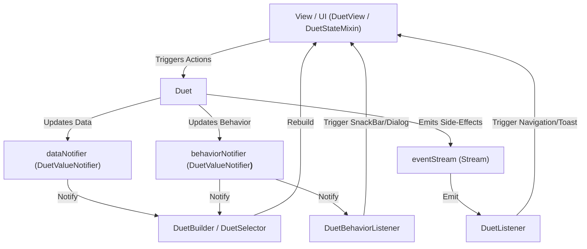
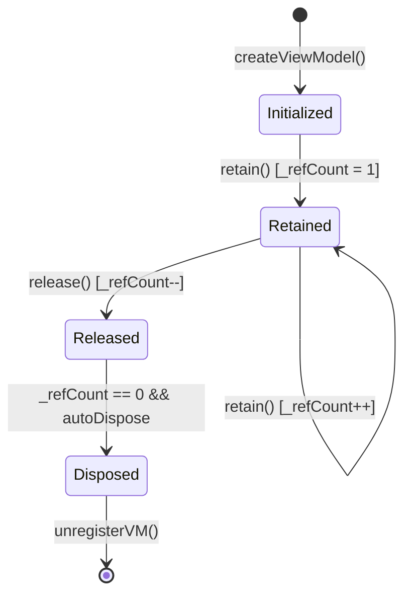

# 📖 TECHNICAL REPORT: DESIGN & IMPLEMENTATION OF `DUET`

> **Project**: `duet` - Pure Flutter Dual-Notifier State Management & MVVM Architecture (Zero External Dependencies).  
> **Location**: `docs/en/duet_technical_doc.md`  
> **Version**: 3.0

---

## 📋 TABLE OF CONTENTS

1. [Architecture & Design Philosophy](#1-architecture--design-philosophy)
2. [Step-by-Step Core Implementation](#2-step-by-step-core-implementation)
   - [Step 1: Standardizing UI State with Sealed Classes (`UiState`)](#step-1-standardizing-ui-state-with-sealed-classes-uistate)
   - [Step 2: Dual ViewModel Engine (`Duet` & `DuetValueNotifier`)](#step-2-dual-viewmodel-engine-duet--duetvaluenotifier)
   - [Step 3: O(1) Scoping & Dependency Injection (`_AnyDuetScope`, `DuetScope` & `DuetRegistry`)](#step-3-o1-scoping--dependency-injection-_anyduetscope-duetscope--duetregistry)
   - [Step 4: Scoped ViewModel Lifecycle Management (`DuetStateMixin` & `DuetView`)](#step-4-scoped-viewmodel-lifecycle-management-duetstatemixin--duetview)
   - [Step 5: One-Shot Side-Effect Event Handling (`DuetListener` & `DuetBehaviorListener`)](#step-5-one-shot-side-effect-event-handling-duetlistener--duetbehaviorlistener)
   - [Step 6: Performance Optimization & Reactive Glitch Prevention (`batch()` & `emitState()`)](#step-6-performance-optimization--reactive-glitch-prevention-batch--emitstate)
   - [Step 7: Synchronized Reactive UI Widgets (`DuetBuilder` & `DuetSelector`)](#step-7-synchronized-reactive-ui-widgets-duetbuilder--duetselector)
3. [Algorithmic Analysis & Core Mechanics](#3-algorithmic-analysis--core-mechanics)
   - [3.1 Reference Counting & AutoDispose Algorithm](#31-reference-counting--autodispose-algorithm)
   - [3.2 O(1) Context Lookup via InheritedWidget Marker (`_AnyDuetScope`)](#32-o1-context-lookup-via-inheritedwidget-marker-_anyduetscope)
   - [3.3 Flutter Engine Layer Optimization](#33-flutter-engine-layer-optimization)
4. [Detailed Architecture Matrix](#4-detailed-architecture-matrix)
5. [Code Examples & Production Patterns](#5-code-examples--production-patterns)
6. [Global Debug Logging & VS Code Snippets](#6-global-debug-logging--vs-code-snippets)

---

## 1. ARCHITECTURE & DESIGN PHILOSOPHY

`duet` solves a major Flutter challenge: **Providing a enterprise-grade State Management & MVVM architecture without relying on any 3rd party packages**.

### Core Philosophy:
1. **100% Native Flutter**: Relies entirely on Flutter Framework primitives (`ValueNotifier`, `InheritedWidget`, `BuildContext`, `StatefulWidget`).
2. **Dual-State Separation**: Separates **Business Data (`D`)** from **UI Behavior State (`B`)**.
3. **Immutability & Safety**: Guards data against accidental in-place mutation using debug assertions.
4. **Developer Experience**: Expressive, clean UI code that eliminates boilerplate.

### 📐 Architecture Diagram:



---

## 2. STEP-BY-STEP CORE IMPLEMENTATION

### Step 1: Standardizing UI State with Sealed Classes (`UiState`)

In `ui_state.dart`, `UiState` defines the immutable base interface:

```dart
@immutable
abstract class UiState {
  const UiState();
}
```

### Step 2: Dual ViewModel Engine (`Duet` & `DuetValueNotifier`)

In `duet_core.dart`, `DuetValueNotifier<T>` provides transactional batching capabilities:

```dart
class DuetValueNotifier<T> extends ValueNotifier<T> {
  bool _isBatching = false;
  bool _hasPendingNotify = false;

  DuetValueNotifier(super.value);

  void beginBatch() => _isBatching = true;

  void endBatch() {
    _isBatching = false;
    if (_hasPendingNotify) {
      _hasPendingNotify = false;
      notifyListeners();
    }
  }

  @override
  void notifyListeners() {
    if (_isBatching) {
      _hasPendingNotify = true;
    } else {
      super.notifyListeners();
    }
  }
}
```

---

## 3. ALGORITHMIC ANALYSIS & CORE MECHANICS

### 3.1 Reference Counting & AutoDispose Algorithm

The resource manager uses reference counting:
1. When a widget attaches to a Duet, it calls `retain()` $\rightarrow$ `_refCount++`.
2. When the widget unmounts (`dispose`), it calls `release()` $\rightarrow$ `_refCount--`.
3. When `_refCount` reaches **0**, if `autoDispose = true`, the Duet automatically disposes itself.



### 3.2 O(1) Context Lookup via `_AnyDuetScope`

`_AnyDuetScope` acts as a non-generic marker class inherited by `DuetScope<VM>`, permitting direct $O(1)$ context lookups across widget subtrees without runtime type reflection penalties.

---

## 4. DETAILED ARCHITECTURE MATRIX

| Feature | `duet` | Flutter BLoC | Riverpod | GetX |
| :--- | :--- | :--- | :--- | :--- |
| **External Dependencies** | **0% (100% Native)** | `flutter_bloc` | `flutter_riverpod` | `get` |
| **Dual State Separation** | Standard `D` & `B` | Manual | Manual (`AsyncValue`) | Manual |
| **Glitch Prevention (Batching)** | Built-in `emit(data, ui)` | Stream buffering | Provider Ref | None |
| **Key Collision Risk** | **0% (`Object.hash`)** | N/A | N/A | High tag collisions |
| **Developer Experience** | Automatic Scoping | Provider Boilerplate | Consumer Ref | Global Get.find |

---

## 5. CODE EXAMPLES & PRODUCTION PATTERNS

```dart
class ProfileViewModel extends Duet<ProfileData, ProfileUiBehavior> {
  ProfileViewModel()
      : super(initialData: const ProfileData(), initialBehavior: const ProfileUiIdle());

  Future<void> saveProfile(String newName) async {
    emitBehavior(const ProfileUiLoading());
    await Future.delayed(const Duration(milliseconds: 600));

    emit(
      data: data.copyWith(name: newName, isEditing: false),
      ui: ProfileUiSuccess("Profile updated successfully!"),
    );
  }
}
```

---

## 6. GLOBAL DEBUG LOGGING & VS CODE SNIPPETS

Global debugging logger setup in `main.dart`:

```dart
void main() {
  WidgetsFlutterBinding.ensureInitialized();
  if (kDebugMode) {
    DuetState.observer = DuetLogger();
  }
  runApp(const MyApp());
}
```
